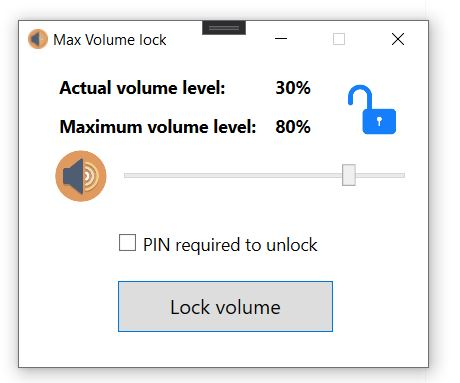
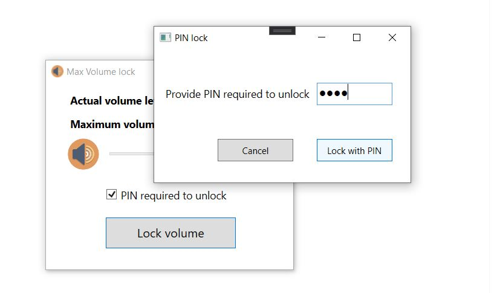

# Max Volume Lock (Legacy WPF app)

Simple utility app for PIN lock your system maximum volume.

## Used NUGet packages

- [NAudio](https://github.com/naudio/NAudio)
- [WPFToolkit](https://github.com/xceedsoftware/wpftoolkit)

## Screenshots

### Main form
Simply set your desired maximum volume level with the slider and click on the `Lock Volume` button.

Note that: You should check the `PIN required to unlock` checkbox for setting up a PIN code. The PIN code will be requested for unlock.

### Lock/Unlock with PIN

